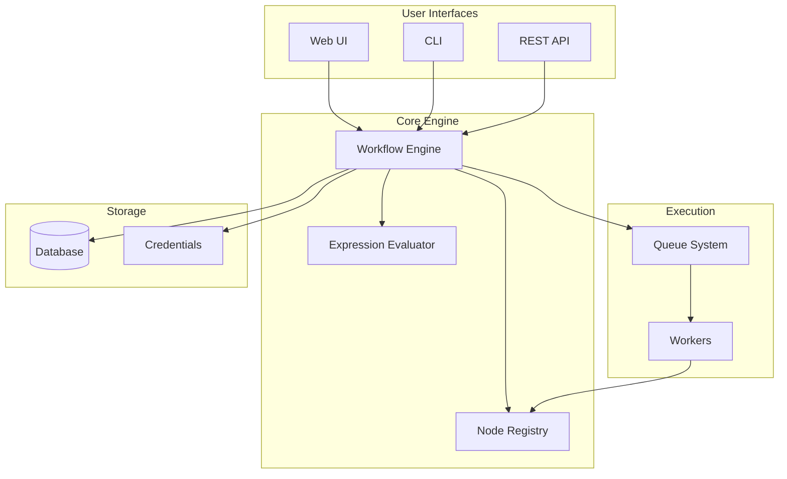

# m9m Documentation

Welcome to the official documentation for **m9m**, a high-performance workflow automation platform built in Go.

## What is m9m?

m9m is a cloud-native workflow automation platform that delivers enterprise-grade performance while maintaining compatibility with existing n8n workflows. Built from the ground up in Go, m9m offers significant performance improvements over Node.js-based alternatives.

## Key Features

<div class="grid cards" markdown>

-   :zap: **High Performance**

    ---

    5-10x faster workflow execution with 70% lower memory usage

-   :cloud: **Cloud Native**

    ---

    Designed for Kubernetes with horizontal scaling support

-   :package: **100+ Integrations**

    ---

    Support for databases, APIs, cloud platforms, and AI services

-   :shield: **Enterprise Ready**

    ---

    Built-in monitoring, tracing, and security features

</div>

## Performance Comparison

| Metric | n8n | m9m | Improvement |
|--------|-----|-----|-------------|
| Workflow Execution | 500ms | 100ms | **5x faster** |
| Memory Usage | 512MB | 150MB | **70% reduction** |
| Cold Start Time | 3s | 500ms | **6x faster** |
| Concurrent Workflows | 50 | 500 | **10x scale** |
| Container Size | 1.2GB | 300MB | **75% smaller** |

## Quick Start

Get up and running in minutes:

=== "Docker"

    ```bash
    docker run -p 8080:8080 m9m/m9m:latest
    ```

=== "Binary"

    ```bash
    wget https://github.com/m9m/m9m/releases/latest/download/m9m-linux-amd64
    chmod +x m9m-linux-amd64
    ./m9m-linux-amd64 serve
    ```

=== "From Source"

    ```bash
    git clone https://github.com/m9m/m9m.git
    cd m9m
    make build
    ./m9m serve
    ```

Then open [http://localhost:8080](http://localhost:8080) in your browser.

## Architecture Overview



## Documentation Sections

### Getting Started

New to m9m? Start here:

- [Introduction](getting-started/introduction.md) - Learn what m9m is and why to use it
- [Installation](getting-started/installation.md) - Install m9m on your system
- [Quick Start](getting-started/quickstart.md) - Run your first workflow
- [Your First Workflow](getting-started/first-workflow.md) - Build a complete workflow

### User Guide

Learn how to use m9m effectively:

- [Workflows](user-guide/workflows.md) - Create and manage workflows
- [Expressions](user-guide/expressions.md) - Use dynamic expressions
- [Credentials](user-guide/credentials.md) - Manage authentication
- [Variables](user-guide/variables.md) - Work with variables and environments

### Nodes Reference

Explore available integrations:

- [Overview](nodes/overview.md) - Node system architecture
- [Transform Nodes](nodes/transform.md) - Data manipulation
- [Database Nodes](nodes/databases.md) - Database integrations
- [AI Nodes](nodes/ai.md) - AI and LLM integrations
- [Custom Nodes](nodes/custom-nodes.md) - Build your own nodes

### Deployment

Deploy m9m in production:

- [Docker](deployment/docker.md) - Container deployment
- [Kubernetes](deployment/kubernetes.md) - Orchestrated deployment
- [Production](deployment/production.md) - Production best practices
- [Scaling](deployment/scaling.md) - Scale for high throughput

## Community & Support

- **GitHub**: [github.com/m9m/m9m](https://github.com/m9m/m9m)
- **Slack**: [slack.m9m.io](https://slack.m9m.io)
- **Enterprise Support**: enterprise@m9m.io

## License

m9m is released under the Apache 2.0 License.
